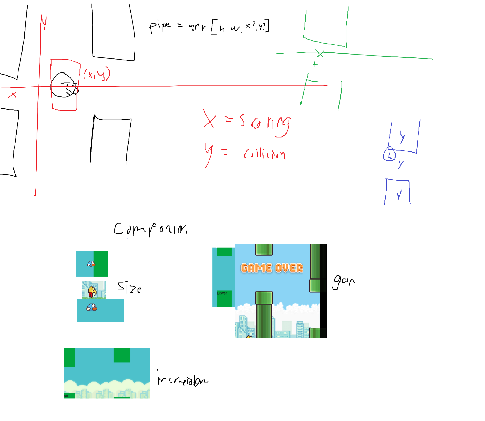

# Flappy Birdie
`February 02, 2026` `JavaScript` `ReactJS` `NextJS` 
Just me and Visual Studio Code, practicing by creating simple games like Flappy Bird. I’m learning how to add gravity, movement, axes, and so on, with almost no use of ChatGPT.

